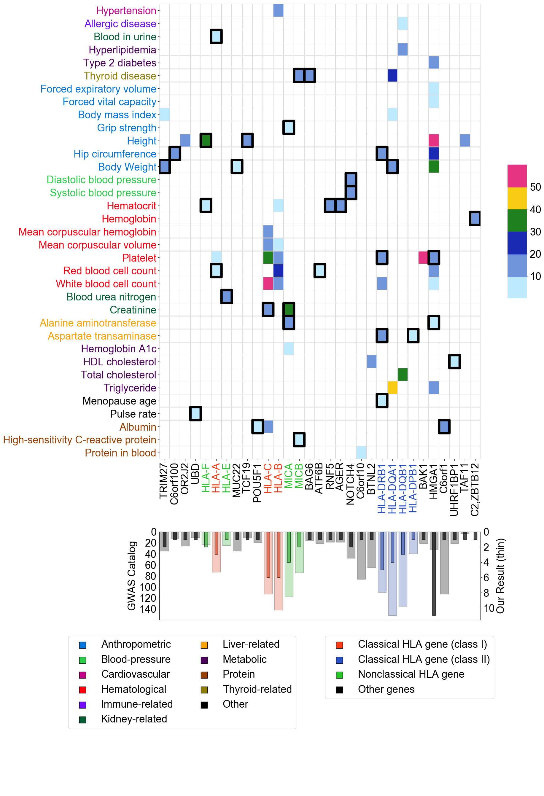
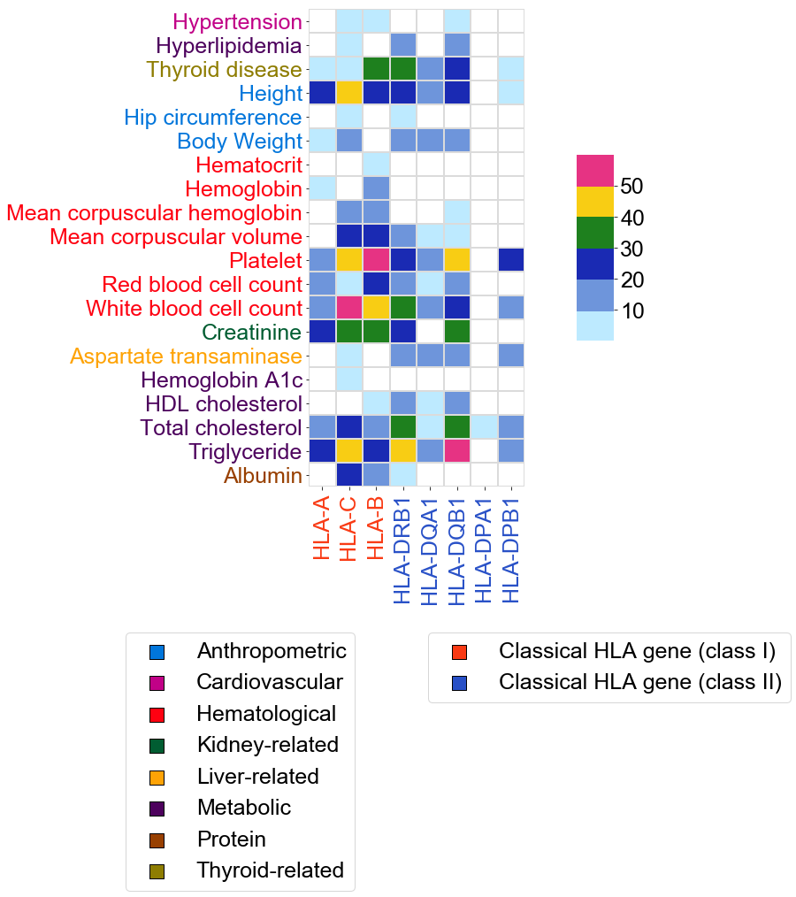

# Phenome-wide association study of the major histocompatibility complex region in the Korean population 

## Abstract

In this study, we comprehensively analyzed associations between phenotypes and genetic variants in the major histocompatibility complex (MHC) region for the Korean population using the Korean Genome and Epidemiology Study (KoGES) data. This data consists of phenotype and genotype information of ~120,000 Korean individuals. We curated 97 overlapping phenotypes across four cohorts in KoGES. We imputed genotypes of 8 classical human leukocyte antigen (HLA) genes, which comprised a total of 119 alleles. We defined markers for the 4-digit HLA alleles, amino acid residues at 349 amino acid positions in 8 HLA genes, and 67,091 SNVs in the MHC region. Using this new single-population dataset, we conducted Phenome-Wide Association Studies (PheWAS) to identify associations within the region to phenotypes. Our analysis confirmed significant associations identified in previous studies and found 36 novel association signals not reported previously. In addition, we analyzed heritability explained by variants in the MHC region and genetic correlations among phenotypes.

## Figures

## PheWAS result - Matrix of phenotype and gene assigned to association signal

Significant associations between phenotype and gene are shown. In addition to the top association signal of each phenotype, we indicated independent associations found by conditional analysis. The novel association signals are marked with thick black edges. The thin bars at the bottom show the total number of association signals per gene. The thick bars at the bottom show the number of associations found in the GWAS catalog. Two-tailed P values calculated with logistic or linear regression are indicated. 

## HLA variant Omnibus Test

## Heritability estimated in the entire MHC region and genetic correlation among phenotypes

(a) We estimated the heritability of phenotypes explained by variants in the MHC region. Although cervical cancer, tuberculosis, and prostate cancer didn’t show any signal above the genome-wide significance threshold, their estimated heritability ranked at the top among the phenotypes included in our analysis. This indicates that single-variant association is insufficient to fully assess the genetic risk of variants in the MHC region. (b) Genetic correlations between phenotypes based on variants in the MHC region are shown. We applied the Fruchterman-Reingold algorithm, a force-directed algorithm, with weights of z score of correlation. Accordingly, phenotypes that are genetically close to one another are clustered together. We found that phenotypes classified into the same category stayed closer together.

# GWAS Manhattan Plot

## White blood cell count

## Height

Horizontal lines are genome-wide-significance threshold. Genetic variants on classical HLA class I genes, classical HLA class II genes, non-classical HLA genes are colored red, blue, and green, respectively.   

# Software

- For genotype munge,
    - [Vcftools](http://vcftools.sourceforge.net/)
    - [Plink](www.cog-genomics.org/plink/2.0/)

- For HLA Imputation,
    - [CookHLA](https://github.com/WansonChoi/CookHLA)

- For HLA variant association test,
    - [GAT (Generic Genome-Wide Association Tool)](https://github.com/ch6845/GAT)

- For HLA variant munge,
    - [HATK(HLA Analysis Toolkit)](https://github.com/WansonChoi/HATK)

# Citation

Chanwoo Kim, et al. “Phenome-wide association study of the major histocompatibility complex region in the Korean population identifies novel association signals.” 
(Under preparation)